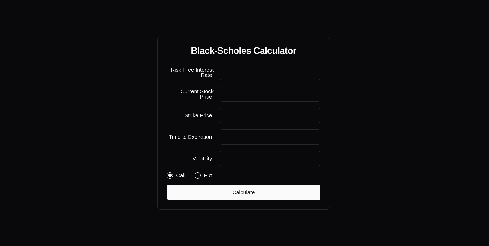

**## Black-Scholes Option Pricer**





**A comprehensive option pricing tool built with Next.js, Tailwind CSS, and Shadcn UI.**

### Getting Started

1. **Clone the repository:**
   ```bash
   git clone https://github.com/adamDucken/black-scholes-option-pricer.git
   ```

2. **Install dependencies:**
   ```bash
   cd black-scholes-option-pricer
   pnpm install
   ```

3. **Start the development server:**
   ```bash
   pnpm dev
   ```

### Usage

- **Input:** Enter the necessary parameters (stock price, strike price, time to maturity (years), risk-free rate , volatility).For percentages use this format 0. for example (5% -> 0.05), everything else is decimal.
- **Output:** The tool will calculate the call and put option prices based on the Black-Scholes model.

### Future Plans

We're excited to announce our plans to rewrite the backend of this application using Python FastAPI. This will enhance performance, scalability, precision, and integration with other financial data sources.

**Note:** This project is currently in development, and features may be subject to change.

